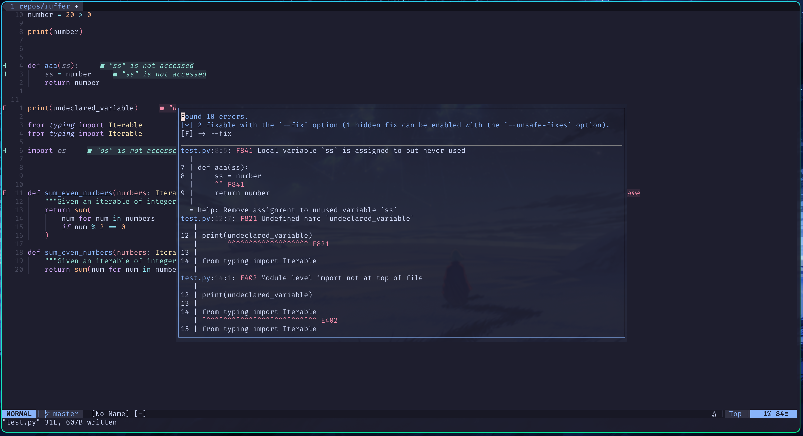

# What is this ?

This plugin uses [Ruff](https://docs.astral.sh/ruff/) to show warnings and errors inside neovim and allows you to run Ruff on the file without having to
open a new terminal window. It supports pyproject.toml and ruff.toml.

# Install

- ruff must be on your path [Astral Site](https://docs.astral.sh/ruff/installation/)

### Lazy

```lua
{
    'acidburnmonkey/ruffer',
    config = function()
      require('ruffer').setup()
    end,
  },
```

### Or Others

```
 {'acidburnmonkey/ruffer'}
```

on init.lua add

```lua
require('ruffer').setup()
```

# Screenshot



# Key Mappings

### Defaults

- \<F5> Show UI
- \<F7> Runs the Ruff Formatter

### Remap Defaults

```lua
-- Load the plugin
require('ruffer')

-- Map :Ruffer to <leader>f for showing errors
vim.keymap.set('n', '<leader>f', ':Ruffer<CR>', { noremap = true, silent = true })

-- Map :RufferFormat to <leader>F for formatting
vim.keymap.set('n', '<leader>F', ':RufferFormat<CR>', { noremap = true, silent = true })
```

<br>
<br>
<br>

# Chill links

<a href="https://www.buymeacoffee.com/acidburn" target="_blank"></a>

## Monero 

```
43Sxiso2FHsYhP7HTqZgsXa3m3uHtxHQdMeHxECqRefyazZfpGVCLVsf1gU68jxJBo1G171AC181q1BqAUaG1m554MLsspG
```

## Bitcon 

```
bc1qk06cyheffclx7x434zpxjzcdl50452r9ducw0x
```
